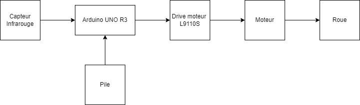

# Robot suiveur de ligne 

| | |
|-|-|
|`Author` | Josue Kabongo

## Description 
Le projet consiste à concevoir et à construire un robot suiveur de ligne autonome à l'aide d'une plateforme Arduino. Le robot sera équipé de capteurs de ligne qui lui permettront de détecter et de suivre des trajectoires spécifiques tracées au sol. À l'aide de moteurs et de circuits de contrôle, le robot ajustera sa trajectoire en temps réel pour rester centré sur la ligne, évitant ainsi les obstacles éventuels.

## Motivation
J'ai choisi ce projet car c'est une excellente introduction dans le monde de la robotique. Cela me permettra d'explorer des concepts de base tout en développant des compétences pratiques en électronique et en programmation.

## Architecture
Le projet utilise un Arduino UNO R3 comme cerveau central pour contrôler le suiveur de ligne. Les capteurs infrarouges sont utilisés pour détecter la ligne tracée sur le sol, tandis que les moteurs permettent au suiveur de ligne de se déplacer le long de cette ligne.

Lorsque le suiveur de ligne est mis sous tension, l'Arduino UNO R3 initialise les différents composants, notamment les capteurs infrarouges et les moteurs. Les capteurs infrarouges effectuent des lectures régulières pour détecter la position de la ligne par rapport au suiveur de ligne.

Les données des capteurs sont ensuite analysées par l'Arduino UNO R3 pour déterminer la direction dans laquelle le suiveur de ligne doit se déplacer pour rester sur la ligne. En fonction de ces données, des signaux sont envoyés aux moteurs pour ajuster la vitesse et la direction du suiveur de ligne afin qu'il suive la ligne tracée sur le sol.

Ainsi, le suiveur de ligne se déplace de manière autonome le long de la piste, ajustant continuellement sa trajectoire en fonction des informations fournies par les capteurs. Cette architecture permet au suiveur de ligne de suivre la ligne tracée sur le sol de manière autonome, en utilisant les données des capteurs infrarouges pour ajuster sa trajectoire et en contrôlant les moteurs pour son déplacement.

### Block diagram

<!-- Make sure the path to the picture is correct -->

### Schematic

### Components

<!-- This is just an example, fill in with your actual components -->

| Device | Usage | Price |
|--------|--------|-------|
| Arduino UNO R3 | Microprocesseur | [27 RON](https://www.emag.ro/placa-de-dezvoltare-compatibila-uno-r3-ch340-cl20/pd/D60C5JBBM/?ref=cart_item) |
| Roue | Permet de se deplacer | [2 RON](https://www.optimusdigital.ro/ro/mecanica-roti/358-roata-de-38-mm-pentru-ax-de-2-mm.html) |
|Capteur infrarouge| Permet de voir la ligne | [14 RON](https://www.optimusdigital.ro/ro/senzori-altele/1266-bara-cu-3-senzori-de-linie.html) |
| Moteur | Permet au Roue de fonctionner | [5 RON](https://www.optimusdigital.ro/ro/motoare-motoare-fara-reductor/362-motor-biaxial-130-15140.html) |
| Driver L9110S | Permet au moteur de fonctionner | [4 RON](https://www.optimusdigital.ro/ro/drivere-de-motoare-cu-perii/480-driver-de-motoare-l9110s.html) |
|Pile 9V| Alimente le circuit | [10 RON](https://www.emag.ro/baterie-philips-ultra-alkaline-9v-1-buc-6lr61e1b-10/pd/DVS1LKBBM/) |
|Connecteur pile | connecte la pile au circuit | [7 RON](https://www.emag.ro/conector-baterie-ajmaker-9-v-140-mm-multicolor-z000572/pd/DZNQLHYBM/?X-Search-Id=dab19345a2da85127514&X-Product-Id=168453902&X-Search-Page=1&X-Search-Position=21&X-Section=search&X-MB=0&X-Search-Action=view)
### Libraries

<!-- This is just an example, fill in the table with your actual components -->

| Library | Description | Usage |
|---------|-------------|-------|
| [lib-name1](link-to-lib) | official description of the lib | Used for accesing the peripherals of the microcontroller  |
| [lib-name2](link-to-lib) | official description of the lib | Used for accesing the peripherals of the microcontroller  |

## Log

<!-- write every week your progress here -->

### Week 6 - 12 May

### Week 7 - 19 May

### Week 20 - 26 May

## Reference links

<!-- Fill in with appropriate links and link titles -->

[Tutoriel youtube](https://youtu.be/t7k9D1jDEtk?si=-1EpZR00yzr7ao1Y)